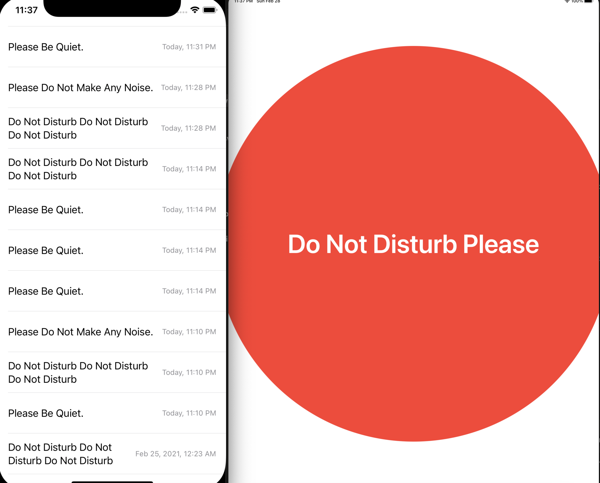

# DoNotDisturb (Shush Pls)

I am building this Swift application to be able to easier and faster notify my loved ones that I am working at the moment and can not be disturbed.

I can press the button on an iPad and my family will get a notification to the iPhone.

It is still in progress, the first raw version though is below: 

Here I used the `Firebase` to set up a database and `SwiftUI` for the layout of the iPhone side, as well as the `AVFoundation` with its `AVAudioPlayer` to play the notifications.

<object data="http://yoursite.com/the.pdf" type="application/pdf" width="700px" height="700px">
    <embed src="http://yoursite.com/the.pdf">
        
This browser does not support PDFs. Please download the PDF to view it: <a href="http://yoursite.com/the.pdf">Download PDF</a>.

    </embed>
</object>
